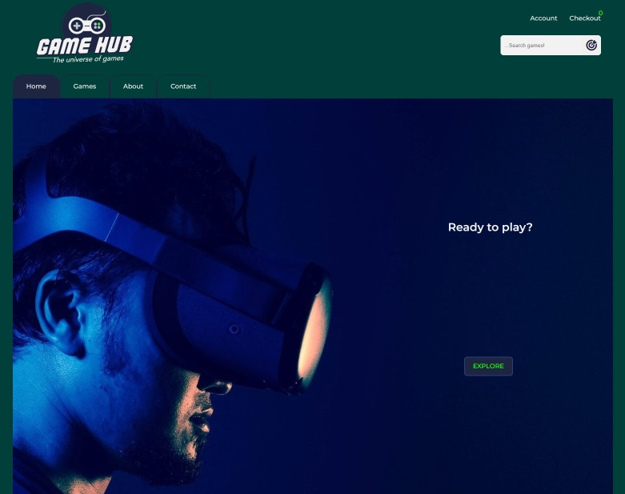

# Game Hub - The Universe of games - Cross Course Project



## Description

This is my cross course project, a project that has been constantly updated throughout the first year of my studies. 

The website is a commercial store online that sells games. It started with plain html and css and has since been updated with javascript and later also utilizing headless-api through Wordpress.

## Built With

- [HTNL](https://developer.mozilla.org/en-US/docs/Web/HTML)
- [CSS](https://developer.mozilla.org/en-US/docs/Web/CSS)
- [Javascript](https://developer.mozilla.org/en-US/docs/Web/JavaScript)

## Getting Started

### Installing

1. Clone the repo:

```bash
git clone git@github.com:NoroffFEU/portfolio-1-example.git
```

2. Install the dependencies:

```
npm install
```

### Running

To run the app, run the following commands:

```bash
npm run start
```

## Contact

[My LinkedIn page](https://www.linkedin.com/in/jon-henrik-aavitsland-abaa872b7/)